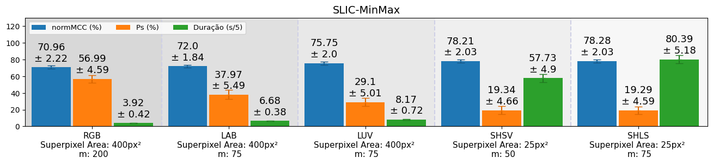

# Low Complexity Segmentation of Urban Afforestation
Data, Graphs and Codes For Evaluating Performance of Low Complexity Methods For Segmenting Urban Afforestation.

Data: `segmentationAnalysis/condoAnalysisData.py`

Data Processing Notebook: `segmentationAnalysis/analyze_segmentation_results.ipynb`

### Best normMCC results For Each Color Space
---

### Mean NormMCC For Each Method (Tecnique + Hyperparameters) Along All Color Spaces
---

||| |
|:---------------:|:----------:|:------------:|
|Mean-SD Threshold|Kmeans + KNN|SLIC + Min-Max|

